 

# Think Machine: Advisor (3E)

This is an Android based application that includes [ThinkMachine](https://softwaremagico.github.io/ThinkMachine/) Java library.  That means that this is a mobile Android application developed to help the user (Game Masters or Players) to create character sheets for the Fading Suns revised edition.

The app is available on Google Play, and this site is only for hosting the source code of the application. If you are only interested on the use of this application as a standard user, please download from  [Google Play](https://play.google.com/store/apps/details?id=com.softwaremagico.tm.advisor).

Some examples of the application:

[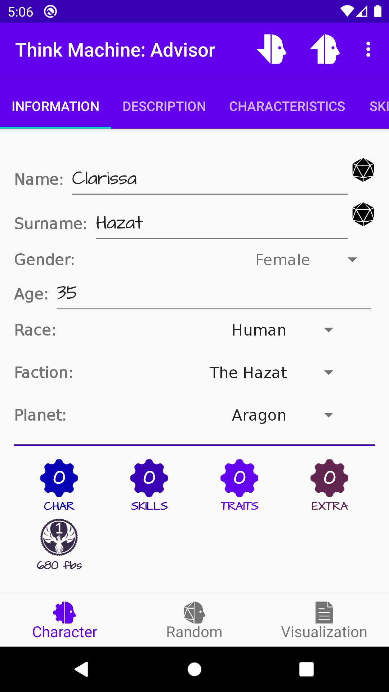](https://play.google.com/store/apps/details?id=com.softwaremagico.tm.advisor) 
[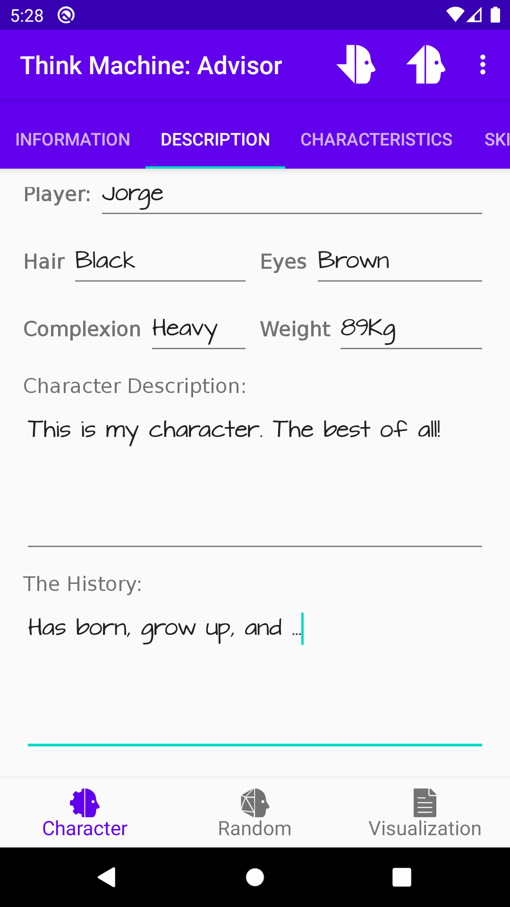](https://play.google.com/store/apps/details?id=com.softwaremagico.tm.advisor) 
[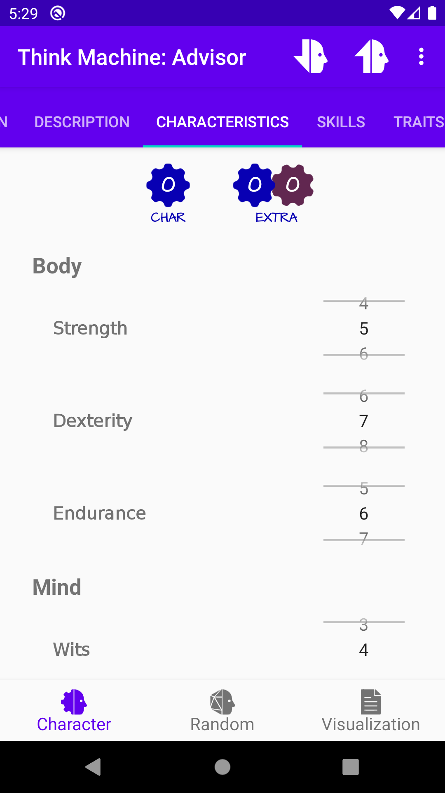](https://play.google.com/store/apps/details?id=com.softwaremagico.tm.advisor) 

[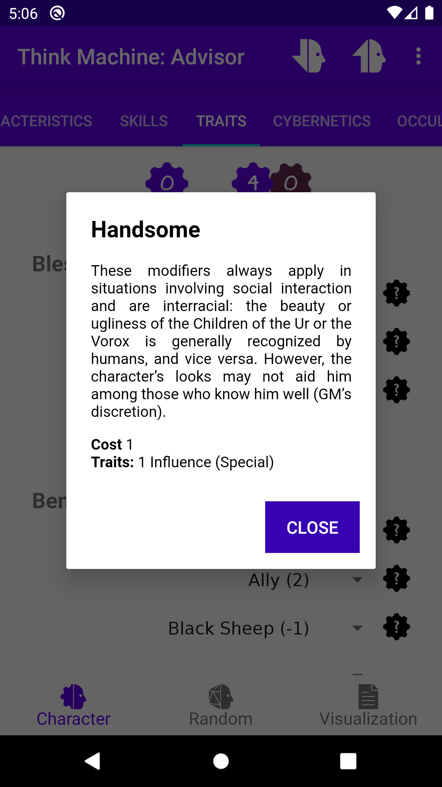](https://play.google.com/store/apps/details?id=com.softwaremagico.tm.advisor)
[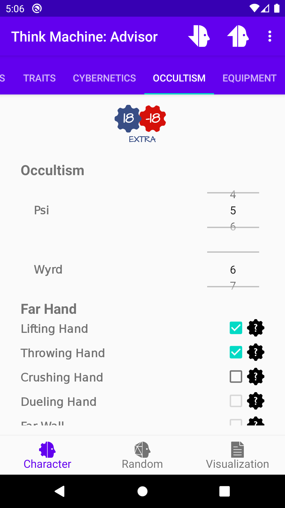](https://play.google.com/store/apps/details?id=com.softwaremagico.tm.advisor) 
[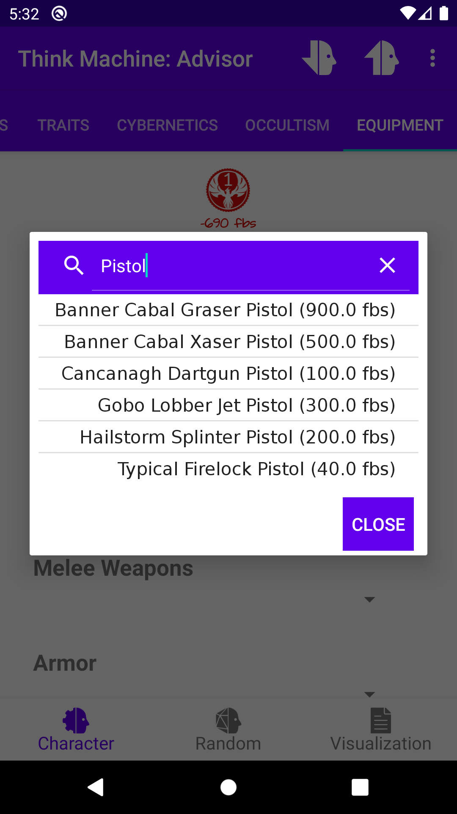](https://play.google.com/store/apps/details?id=com.softwaremagico.tm.advisor) 

[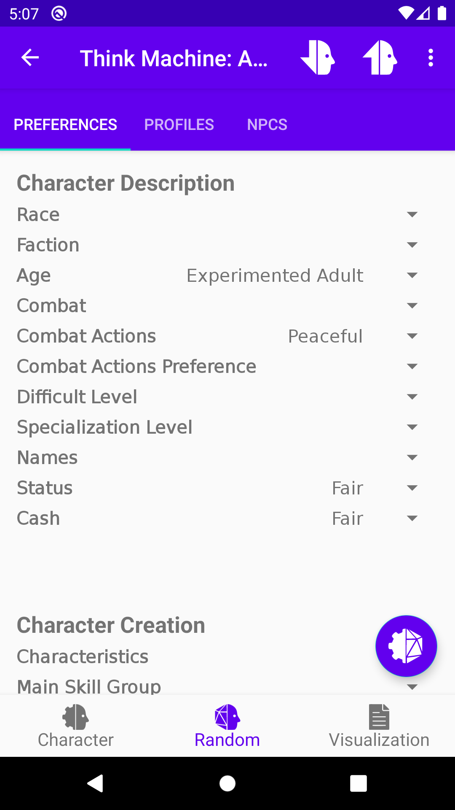](https://play.google.com/store/apps/details?id=com.softwaremagico.tm.advisor) 
[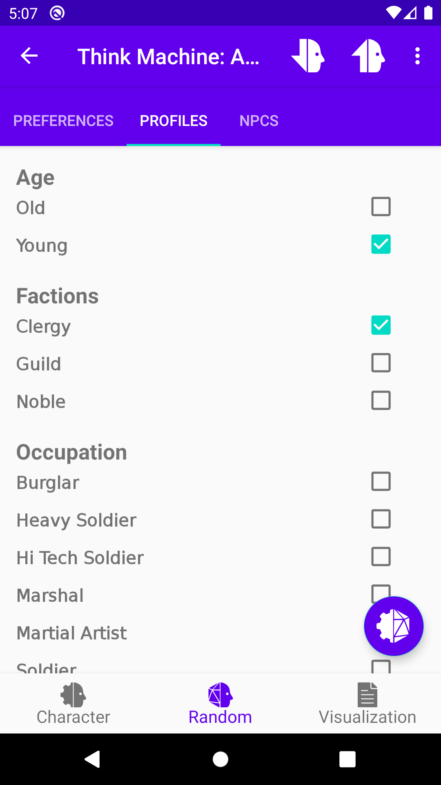](https://play.google.com/store/apps/details?id=com.softwaremagico.tm.advisor) 
[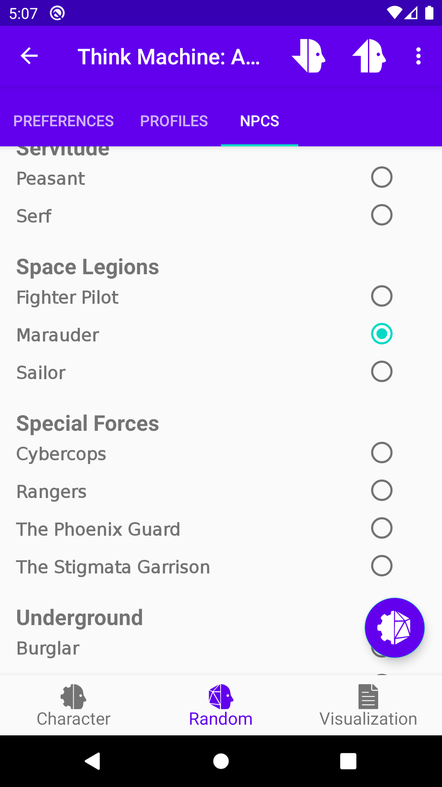](https://play.google.com/store/apps/details?id=com.softwaremagico.tm.advisor) 

[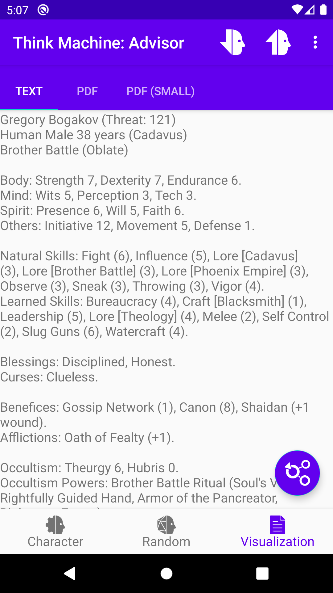](https://play.google.com/store/apps/details?id=com.softwaremagico.tm.advisor) 
[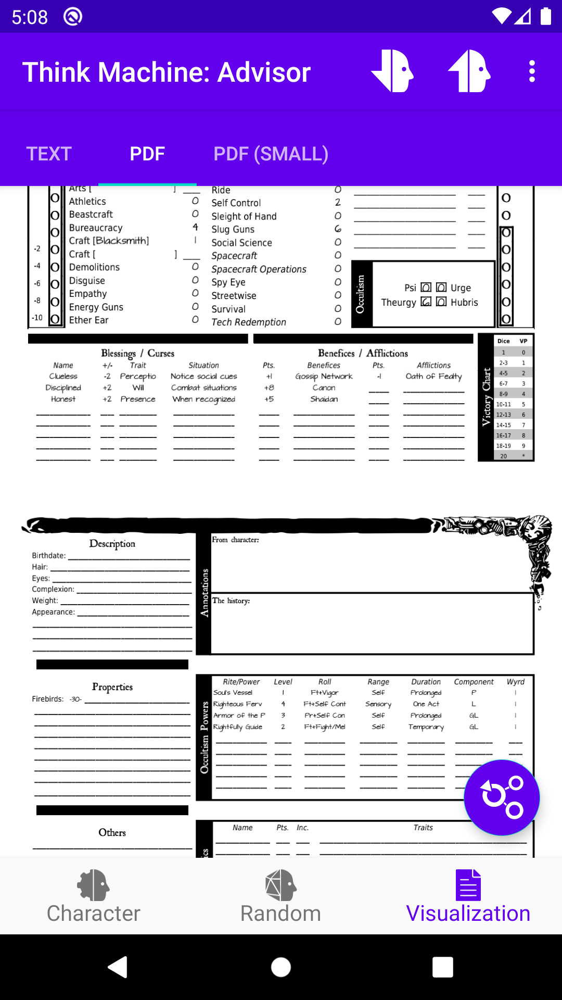](https://play.google.com/store/apps/details?id=com.softwaremagico.tm.advisor) 
[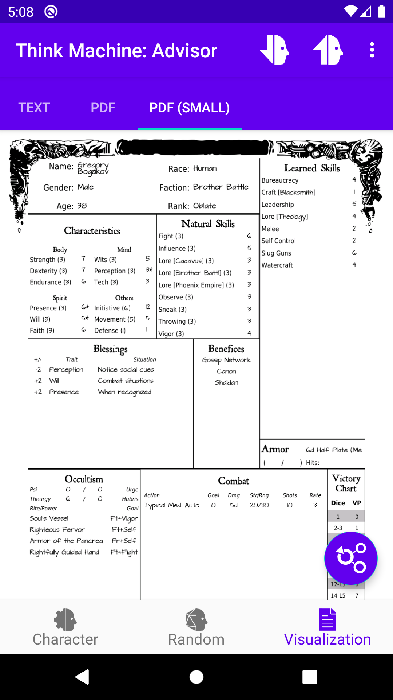](https://play.google.com/store/apps/details?id=com.softwaremagico.tm.advisor) 

[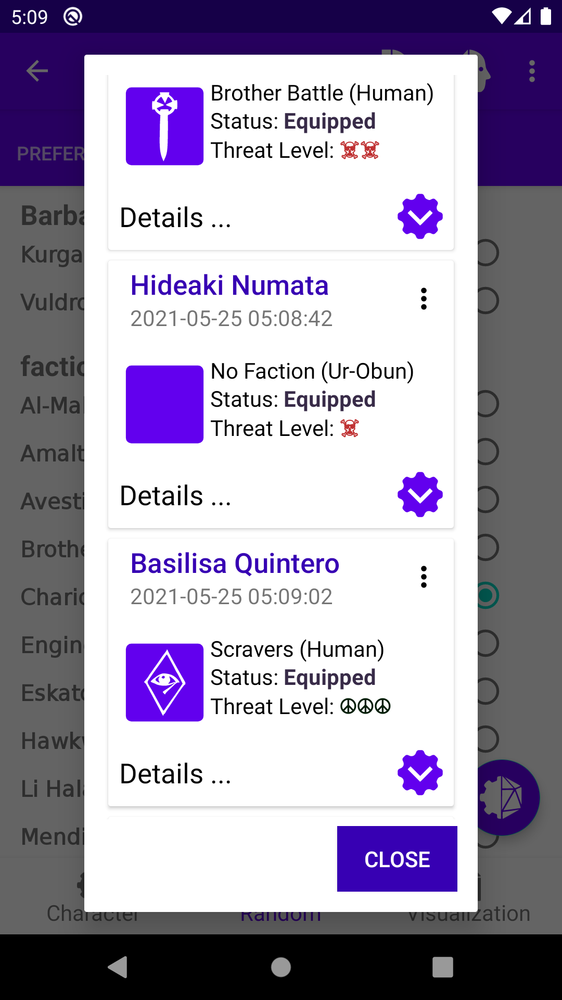](https://play.google.com/store/apps/details?id=com.softwaremagico.tm.advisor) 
[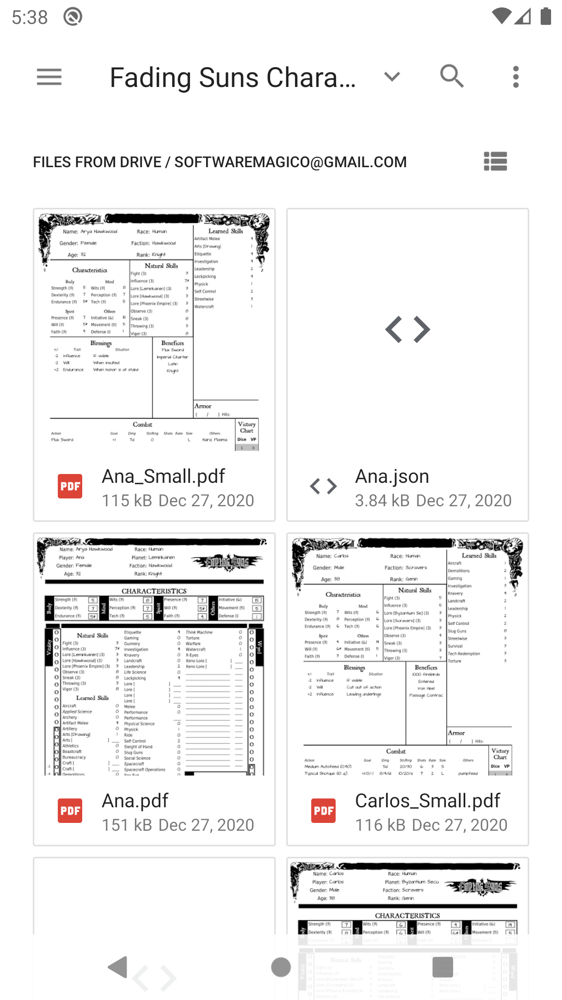](https://play.google.com/store/apps/details?id=com.softwaremagico.tm.advisor)
 

## Roadmap

0.1 Basic Character Sheet generation.
- 0.1.1 PDF Chart generation.
- 0.1.2 Export PDF charts.

0.2 Options to load and save a character.
- 0.2.1 Load character description.

0.3 Options to import and export a character.
- 0.3.1 Options to load a character sheet from google drive.

0.4 Point counters for characteristics and skills
- 0.4.1 Firebirds counters. 
- 0.4.2 Code minified.

0.5 Random Character generation
- 0.5.1 Added armors and shields descriptions
- 0.5.2 Added weapons descriptions
- 0.5.3 Added item search option for selection. 

0.6 Cybernetics added
- 0.6.1 Added minor noble houses factions

0.7 Occultism
- 0.7.1 Occultism path descriptions

0.8 Random Profiles
- 0.8.1 Random NPCs
- 0.8.2 Added Aliens from Player Companion
- 0.8.3 Added Minor Guilds from Player Companion
- 0.8.4 Added Minor Church Orders and other Psi Powers

0.9 Stability and Performance improvements. 

0.10 Bug review
- 0.10.1 Bug fixing
- 0.10.2 Bug fixing
- 0.10.3 Bug fixing
- 0.10.4 Adapted to Android 13

