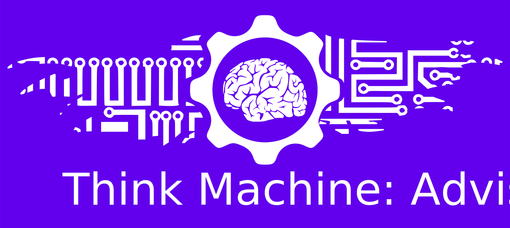

 

# Think Machine: Advisor

This is an Android based application for the use of [ThinkMachine](https://softwaremagico.github.io/ThinkMachine/) Java library.  That means that this is a mobile Android application developed to help the user to create character sheets for the Fading Suns revised edition.

The app is available on Google Play, and this site is only for hosting the source code of the application. If you are interested only on the use of this application as a standard user, please search it on Google Play.

## Roadmap

0.1 Basic Character Sheet generation.
- 0.1.1 PDF Chart generation.
- 0.1.2 Export PDF charts.

0.2 Options to load and save a character.
- 0.2.1 Load character description.

0.3 Options to import and export a character.
- 0.3.1 Options to load a character sheet from google drive.

0.4 Point counters for characteristics and skills
- 0.4.1 Firebirds counters. 
- 0.4.2 Code minified.

0.5 Random Character generation
- 0.5.1 Added armors and shields descriptions
- 0.5.2 Added weapons descriptions
- 0.5.3 Added item search option for selection. 

0.6 Cybernetics added
- 0.6.1 Added minor noble houses factions

0.7 Occultism
- 0.7.1 Occultism path descriptions

0.8 Random Profiles

